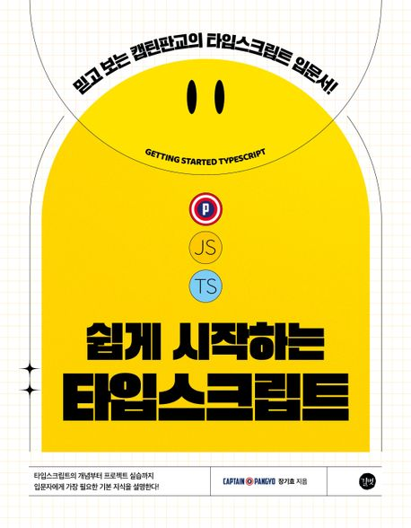

# 쉽게 시작하는 타입스크립트

## 타입스크립트 시작하기

[타입스트립트 기초: 변수와 함수의 타입 정의](./%EB%B3%80%EC%88%98%EC%99%80%20%ED%95%A8%EC%88%98%EC%9D%98%20%ED%83%80%EC%9E%85%EC%A0%95%EC%9D%98/README.md)
[인터페이스](./%EC%9D%B8%ED%84%B0%ED%8E%98%EC%9D%B4%EC%8A%A4/README.md)
[연산자를 사용한 타입정의](./%EC%97%B0%EC%82%B0%EC%9E%90%EB%A5%BC%20%EC%82%AC%EC%9A%A9%ED%95%9C%20%ED%83%80%EC%9E%85%EC%A0%95%EC%9D%98/README.md)
